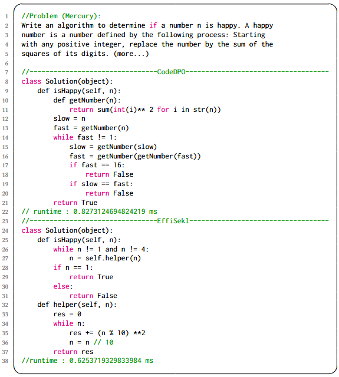
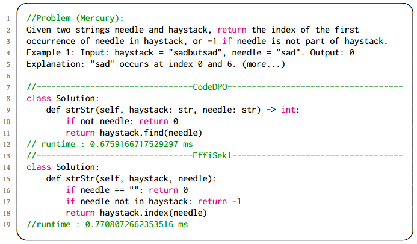
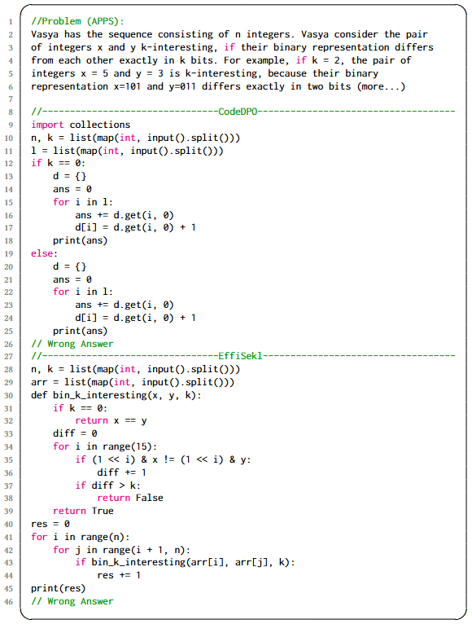

# EffiSkel

⚡️ EffiSkel is a high-efficiency code generation framework with structured skeleton supervision.
This repository contains code, data, and models related to the FSE 2026 paper: "Chiseling Out Efficiency: Structured Skeleton Supervision for Efficient Code Generation".

  
Contributions

  - Conceptual Innovation. We propose the concept of an efficiency skeleton to highlight structural aspects that strongly influence code efficiency. While efficiency also depends on external factors (e.g., hardware or compilers), we focus on structural properties as they offer actionable, learnable signals for LLMs. By using these patterns as explicit supervision—rather than relying solely on code examples—we guide models to encode algorithmic best practices and performance-aware programming more effectively.
  - Technical Advances. We propose three complementary strategies to systematically extract representative efficiency skeletons. Moreover, we develop a structure-aware multi-task learning framework that jointly optimizes skeleton prediction and code generation, effectively embedding efficiency insights directly into LLM training.
  - Empirical Validation. We introduce the APPS+EFFI benchmark, explicitly focusing on efficiency-critical code generation tasks, and demonstrate through extensive experiments that EffiSkel achieves significant improvements in runtime efficiency across multiple programming languages and benchmarks.

---

## 📁 Project Structure

<pre>
EffiSkel/
├── configs/ # ⚙️ Training and Inference Setup
├── data/ # 📊 Benchmark datasets
├── Datasets/ # 📦 Datasets processing
├── evaluate/ # 📝 Evaluate code correctness & efficiency
├── trainer/ # 🎯 Training launcher
├── transformers/ # 🧩 Model backbone and customization
├── generate.py/ # 🚀 Generation code
├── train.py/ 🏋️ Model training
├── requirement.py/ # 📋 Project requirements
└── README.md/ # 📖 Project documentation
</pre>
  
---

## 🧰 Installation 

Please follow the requirements.txt file to install the relevant dependencies or run:

<pre> pip install -r requirements.txt</pre>

Since our method modifies the transformers of huggingface, please make sure to install the same transformers as ours (we use transformers version 4.44.2):

<pre>
cd transformers
pip install -e .
</pre>
  
## 📚 Datasets

We use the datasets APPS+EFFI for training.

You can download the APPS+EFFI dataset from the [data](data/APPS+EFFI) folder.

We use five datasets for evaluation: Mercury & ENAMEL & APPS & EffiBench & HumanEval-X(Java).

You can download the  Mercury dataset [here](https://github.com/Elfsong/Mercury),  ENAMEL dataset [here](https://github.com/q-rz/enamel),  APPS dataset [here](https://github.com/hendrycks/apps) , EffiBench [here](https://github.com/huangd1999/EffiBench) and  HumanEval-X(Java) dataset [here](https://github.com/openai/human-eval).

## 🤗 Model
We fine-tune on five models:
  - [Qwen2.5-Coder (1.5B)](https://huggingface.co/Qwen/Qwen2.5-Coder-1.5B-Instruct)
  - [StarCoder2 (3B)](https://huggingface.co/bigcode/starcoder2-3b)
  - [DeepSeek-Coder (6.7B)](https://huggingface.co/deepseek-ai/deepseek-coder-6.7b-instruct)
  - [CodeLlama (7B)](https://huggingface.co/codellama/CodeLlama-7b-Python-hf)
  - [Qwen2.5-Coder (7B)](https://huggingface.co/Qwen/Qwen2.5-Coder-7B-Instruct)

## 🧲 Extracting
Three skeletons can be extracted by the following code:
<pre>
python SMS.py
python SSS.py
python TAS.py
</pre>

## 🏋️ Finetuning

First, fine-tune the base model on the code of the APPS+EFFI dataset and the corresponding natural language description of the APPS dataset by running the following code:
<pre>
python train_base_model.py
</pre>
Then, fine-tune the base model in a multi-task framework :
<pre>
python train_mask_model.py
python train_skeleton_model.py
python train_total_model.py
</pre>

## ✨ Generating

Generate candidate codes for different fine-tuning methods:
<pre>
python generate_base.py
python generate_mask.py
python generate_skeleton.py
python generate_total.py
</pre>

## 📊 Evaluate

You can run "test_one_solution.sh" to evaluate the functional correctness and efficiency of the generated code:
<pre>
cd evaluate/metric
bash test_one_solution.sh
cd evaluate/metric_time
bash test_one_solution.sh
</pre>

## 🔍 Qualitative Analysis

Qualitative analysis (Figs. 1–3). Aggregate metrics show trends, but they don’t explain why a model writes faster or slower code on a given task. We therefore look at three small case studies from Code Llama (7B) on Mercury and APPS, comparing EffiSkel and CodeDPO.

Fig. 1 — EffiSkel is faster. CodeDPO runs in 0.827 ms; EffiSkel runs in 0.625 ms. EffiSkel tends to write integer loops with a simple sentinel early exit (e.g., checking n==1 or n==4). This avoids string conversions and extra helper calls. The big-O is the same, but the constant cost is smaller. By contrast, CodeDPO often uses fast/slow pointers plus converting n to a string, which creates extra objects and interpreter work.

Fig. 2 — CodeDPO is faster. When speed depends on the right library call, CodeDPO often chooses a fused call (e.g., a single find() that both checks and returns the index). EffiSkel often writes “check then index” (needle in haystack + haystack.index(needle)), which searches twice on hits. That extra pass adds constant overhead. This suggests we should teach EffiSkel these fused patterns during training.

Fig. 3 — both are wrong, but EffiSkel is easier to fix. On spec-sensitive tasks (e.g., “exactly k bits differ,” dynamic bit width, edge cases), both models can be incorrect. EffiSkel usually produces cleaner structure: a small helper, early exit, and clear boundary checks. The bug is often a small semantic slip (exact vs. at-most, bit-width choice) and can be patched locally. CodeDPO more often mixes cases or duplicates code, which tangles control flow and makes the fix larger.

Summary. EffiSkel more often writes low-allocation, early-exit code and gains speed; it falls behind when a single well-chosen library call is the key; and even when wrong, its code is typically easier to repair. 

